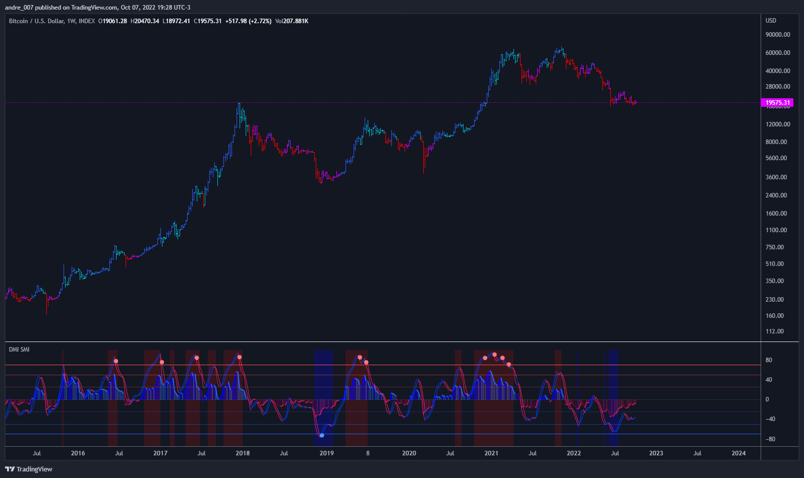

# █ DMI Stochastic Momentum Index

This is an improved version of the "DMI Stochastic Extreme Refurbished" indicator.

The difference is that here, instead of using the traditional stochastic oscillator, I implemented the use of the Stochastic Momentum Index (SMI).

For more information on the original indicator, please access this link:

[DMI Stochastic Extreme Refurbished](https://github.com/andreperez/DMI-Stochastic-Extreme-Refurbished)

## █ Stochastic Momentum Index (SMI)

The SMI is considered a refinement of the stochastic oscillator.
It calculates the distance of the current closing price as it relates to the median of the high/low range of price.
William Blau developed the SMI, which attempts to provide a more reliable indicator, less subject to false swings.

The original stochastic is limited to values from 0 to 100, while the SMI varies between the range of -100 to 100.
(Investopedia)

It is worth mentioning that the SMI presented in this script applies to the DMI value, not the screen price.

## █ DMI Stochastic Extreme

DMI Stochastic Extreme was originally published by Barbara Star, PhD, in TASC magazine of January 2013.
Basically it describes an improved version of the ADX DI+/DI- indicator, created by J. Welles Wilder.

In the setup described by the author, the DMI Oscillator is used together with a stochastic oscillator of DMI.
First, the DMI Oscillator is obtained by subtracting the minus directional movement indicator value (DI-) from the plus directional movement value (DI+).
The final result is the "DMI Stochastic Extreme" indicator, in which the stochastic oscillator is calculated. Only instead of using the price value, the stochastic is obtained through the DMI value.

## █ THANKS AND CREDITS

- Barbara Star (original creator)
- ucsgears (arrow logic)

## █ DONATIONS

- BTC: 3AK6MxX93czQraP4AFv1wKYDvPnPipgF51
- LTC: MBabKb6vedx3UsxTwMJCPPjKdLJSr6dczS
- Dash: XcmdgWfnNQeJEJhkd6pUaaQpmT3AiA98QA
